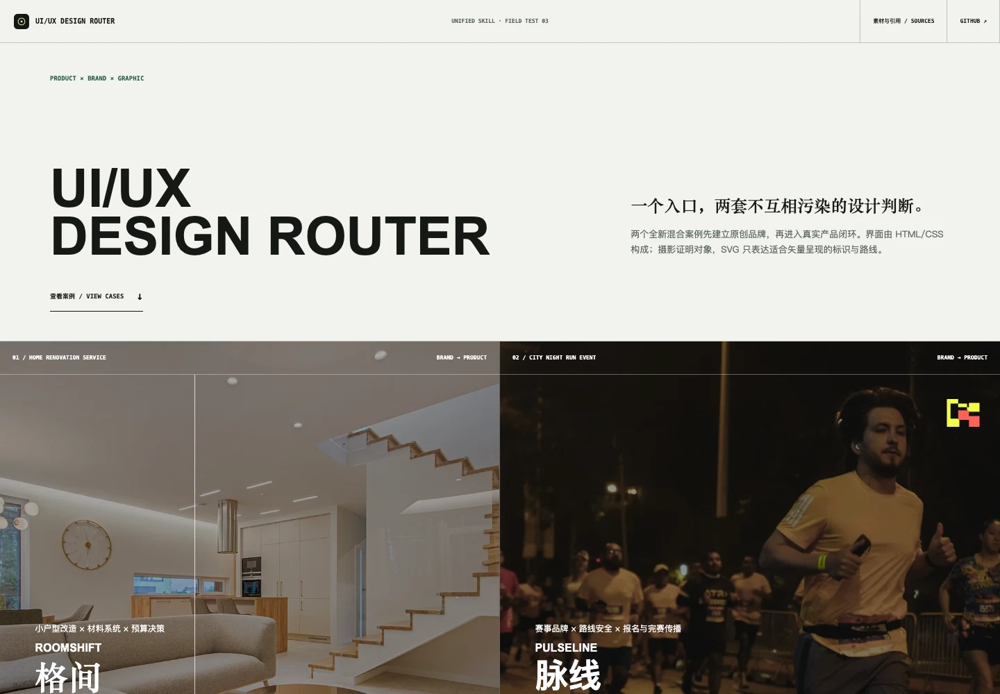
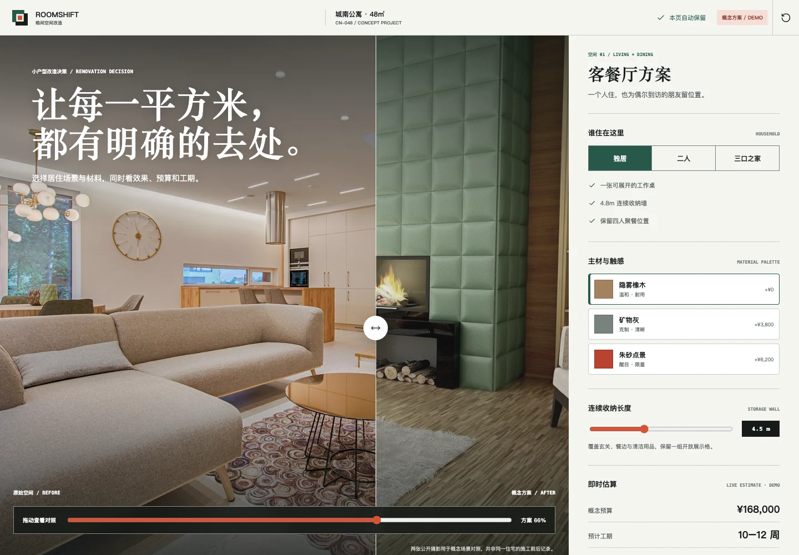
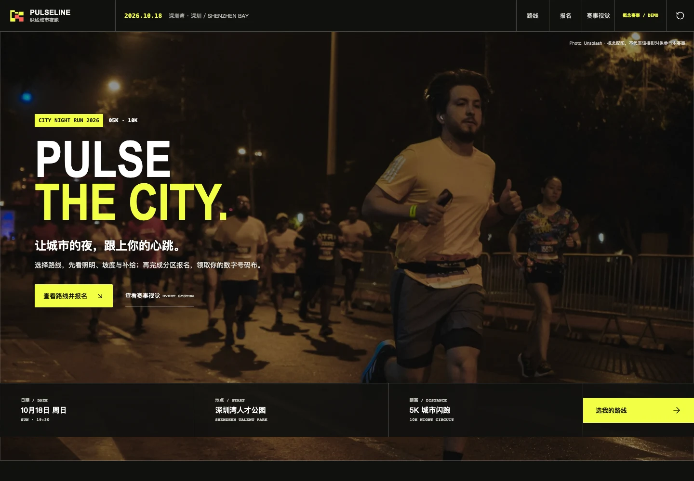

# UI/UX Design Router

[简体中文](./README.md) | [English](./README_EN.md)

[](./LICENSE)
[](https://hachikoj.github.io/ui-ux-design-router/)

一个通用的 AI coding/design agent 设计路由技能：先判断交付物属于产品 UI/UX、品牌/平面或混合项目，再按需加载内部能力，选择一条可解释的视觉与交互/生产方向，最后用对应质量门禁验证。它适用于支持 `SKILL.md`、项目指令或同类 agent 工作流的工具；同一个入口统一承载产品、品牌与平面能力。

> 本项目是独立创作，不是任何上游项目的官方发行版，也不代表上游作者或组织。

## 项目入口

- GitHub 仓库：<https://github.com/HachikoJ/ui-ux-design-router>
- 在线案例：<https://hachikoj.github.io/ui-ux-design-router/>
- 引用与鸣谢：[`ACKNOWLEDGMENTS.md`](./ACKNOWLEDGMENTS.md)
- English README：[`README_EN.md`](./README_EN.md)

## 能解决什么

- 根据最终交付物先选择 product、brand/graphic 或 mixed 分支；混合项目固定先品牌、后产品。
- 产品分支明确用户、设备、north-star action、信息架构、组件、状态与交互恢复。
- 品牌/平面分支覆盖策略、命名、Logo、视觉系统、Campaign、海报、编辑出版、包装、导视、模板与生产交付。
- 根据内容密度与使用场景选择产品模式，或根据媒介与系统深度选择品牌项目模式。
- 选择一个主视觉参考，最多配一个辅助参考，避免把多个品牌皮肤混在一起。
- 将参考转译为项目自己的 tokens、组件规则、交互状态和 Do/Don't 清单。
- 检查键盘、焦点、触控、响应式、加载、错误、恢复和 reduced-motion 状态。

## 安装

把技能目录复制到所用工具的 skills 目录。下面以常见的 `~/.codex/skills` 目录为示例，其他工具请替换为自己的安装路径：

```bash
git clone https://github.com/HachikoJ/ui-ux-design-router.git /tmp/ui-ux-design-router
mkdir -p ~/.codex/skills
cp -R /tmp/ui-ux-design-router/ui-ux-design-router ~/.codex/skills/
```

然后在任务中使用：

```text
使用 $ui-ux-design-router，先判断 product、brand/graphic 或 mixed 分支，再执行对应设计与质量门禁。
```

其他支持技能文件或项目级 agent instructions 的工具，也可以直接引用同一个 `ui-ux-design-router/SKILL.md`；安装目录和调用语法按工具约定调整。

## 目录结构

```text
ui-ux-design-router/   # 唯一可安装入口，内部含产品与品牌/平面分支
showcase/              # 两个可直接打开的静态案例
docs/screenshots/      # 当前线上版本的页面截图
assets/                # 联系与支持图片
ACKNOWLEDGMENTS.md     # 上游项目、研究来源与鸣谢
.github/workflows/      # GitHub Pages 部署工作流
```

## 案例

在线案例展示了同一个技能入口如何为两个复合跨领域任务选择完全不同的结构、字体、容器、品牌与交互方法：

- **格间 ROOMSHIFT**：小户型改造 × 材料系统 × 预算决策。重点是原创空间品牌、真实摄影对照、家庭场景与材料配置、预算/工期联动、撤销恢复、概念方案生成和预约核对。
- **脉线 PULSELINE**：城市夜跑 × 赛事品牌 × 路线安全 × 报名服务。重点是原创赛事身份、号码布与导视延展、5K/10K 路线判断、表单确认、数字号码布和完赛分享状态。

案例使用原创文案、原创 SVG 品牌标识、明确标注的模拟数据和可追溯的公开摄影素材，不复制上游项目的 Logo、专有文案或精确布局。界面以语义化 HTML/CSS 为主，不使用 Canvas 承载 UI；地点、预算、工期、赛事、排名和结果均为概念演示，不代表真实业务。

## 页面截图

### Showcase 首页



<table>
  <tr>
    <td width="50%">
      <strong>格间 ROOMSHIFT</strong><br>
      
    </td>
    <td width="50%">
      <strong>脉线 PULSELINE</strong><br>
      
    </td>
  </tr>
</table>

## 许可证

本项目采用 [MIT License](./LICENSE)。上游项目的许可证和原始仓库地址请以 [`ACKNOWLEDGMENTS.md`](./ACKNOWLEDGMENTS.md) 记录为准；本项目不会把上游许可证误写成自己的许可证。

## 作者与联系方式

- 作者：**Wilson** · [@HachikoJ](https://github.com/HachikoJ)
- GitHub：<https://github.com/HachikoJ/ui-ux-design-router>
- 问题反馈：<https://github.com/HachikoJ/ui-ux-design-router/issues>
- 微信：`hostrow`（添加时请备注“UI/UX Design Router”）

欢迎通过 Issue 反馈路由判断、技能结构、案例交互或文档问题。请不要在 Issue 中公开 token、账号、客户资料或其他敏感信息。

<table>
  <tr>
    <td align="center">
      <strong>微信联系</strong><br>
      
    </td>
    <td align="center">
      <strong>微信赞赏</strong><br>
      
    </td>
    <td align="center">
      <strong>支付宝赞赏</strong><br>
      
    </td>
  </tr>
</table>

赞赏完全自愿，不影响项目使用、反馈处理或后续更新。