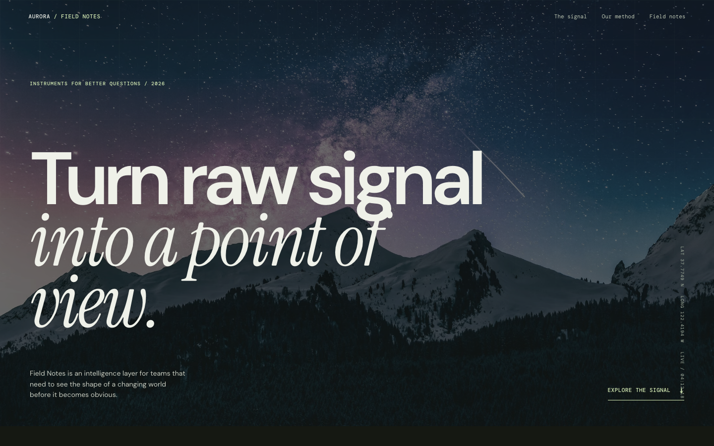
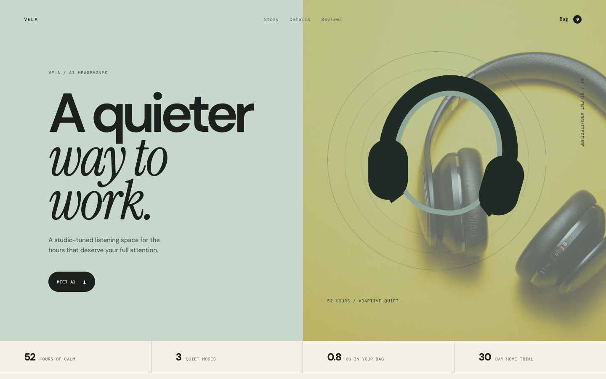

# UI/UX Design Router

[简体中文](./README.md) | [English](./README_EN.md)

[](./LICENSE)
[](https://hachikoj.github.io/ui-ux-design-router/)

A UI/UX routing skill for Codex. It identifies the product mode, user task, interaction constraints, and device priorities before selecting one coherent visual direction. It then turns that direction into executable design context and validates the result with browser-based quality gates.

> This is an independent project. It is not an official distribution of, and is not endorsed by, any upstream project or organization.

## Project Links

- GitHub repository: <https://github.com/HachikoJ/ui-ux-design-router>
- Live showcase: <https://hachikoj.github.io/ui-ux-design-router/>
- Sources and acknowledgments: [`ACKNOWLEDGMENTS.md`](./ACKNOWLEDGMENTS.md)
- Chinese README: [`README.md`](./README.md)

## What It Does

- Defines the product, primary user, north-star action, device priority, and content-density needs before implementation.
- Routes work to operational, devtool, editorial, brand, commerce, touch-first, creative, or data-heavy modes.
- Selects one primary visual reference and, when justified, at most one supporting reference.
- Translates references into native tokens, component rules, interaction states, and Do/Don't constraints.
- Reviews keyboard, focus, touch, responsive, loading, error, recovery, and reduced-motion behavior.

## Installation

Clone the repository and copy the skill directory into your Codex skills folder:

```bash
git clone https://github.com/HachikoJ/ui-ux-design-router.git /tmp/ui-ux-design-router
mkdir -p ~/.codex/skills
cp -R /tmp/ui-ux-design-router/ui-ux-design-router ~/.codex/skills/
```

Then invoke the skill in a task:

```text
Use $ui-ux-design-router. Provide the route decision first, implement the UI,
then review it in a real browser using quality-gates.md.
```

## Repository Layout

```text
ui-ux-design-router/   # Installable Codex skill
showcase/              # Two static, interactive case studies
docs/screenshots/      # Screenshots of the current live deployment
assets/                # Contact and optional-support images
ACKNOWLEDGMENTS.md     # Upstream sources and credits
.github/workflows/      # GitHub Pages deployment workflow
```

## Showcase Cases

- **Aurora Field Notes**: a brand/editorial route focused on narrative, signals, and reading rhythm.
- **Vela A1**: a commerce/object route focused on product recognition, details, selection, reviews, and purchase feedback.

The cases use original copy, CSS-built graphics, and public image URLs. They do not copy upstream logos, proprietary copy, or exact layouts.

## Screenshots

### Showcase Home


<table>
  <tr>
    <td width="50%">
      <strong>Aurora Field Notes</strong><br>
      
    </td>
    <td width="50%">
      <strong>Vela A1</strong><br>
      
    </td>
  </tr>
</table>

## License

This project is released under the [MIT License](./LICENSE). Upstream projects retain their own licenses; see [`ACKNOWLEDGMENTS.md`](./ACKNOWLEDGMENTS.md) for verified original repositories and license notes.

## Author And Contact

- Author: **Wilson** · [@HachikoJ](https://github.com/HachikoJ)
- Repository: <https://github.com/HachikoJ/ui-ux-design-router>
- Issues: <https://github.com/HachikoJ/ui-ux-design-router/issues>
- WeChat: `hostrow` (please mention “UI/UX Design Router” in your request)

Use GitHub Issues for routing decisions, skill structure, showcase interactions, or documentation feedback. Do not post tokens, account credentials, client data, or other sensitive information in a public issue.

<table>
  <tr>
    <td align="center">
      <strong>WeChat Contact</strong><br>
      
    </td>
    <td align="center">
      <strong>WeChat Support</strong><br>
      
    </td>
    <td align="center">
      <strong>Alipay Support</strong><br>
      
    </td>
  </tr>
</table>

Support is entirely optional and does not affect access, issue handling, or future updates.
